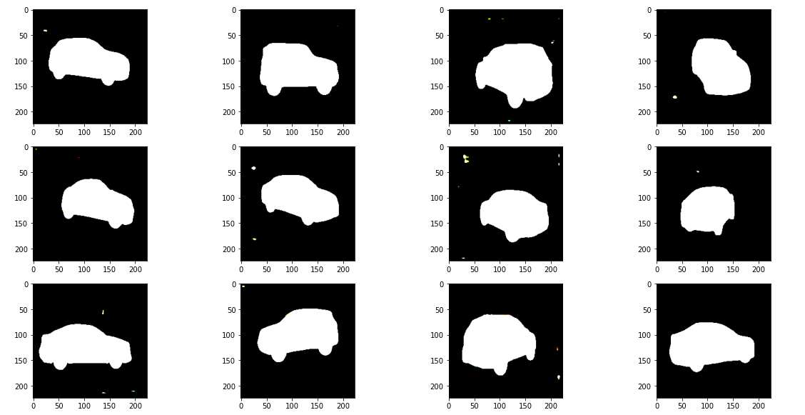

# Carvana-Image-Masking-Challenge

This repository contains the solution for the Carvana Image Masking Challenge on Kaggle. The goal of the competition is to accurately segment cars within images. A UNET model is used and trained on training images and masking images. OpenCV is used for image operations and Tensorflow Keras for model creation.

Challenge Link : https://www.kaggle.com/competitions/carvana-image-masking-challenge

